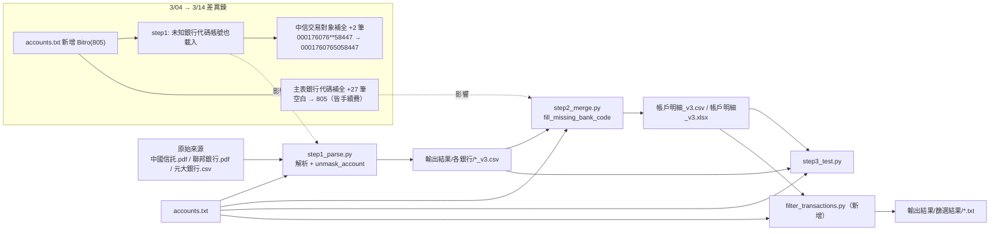
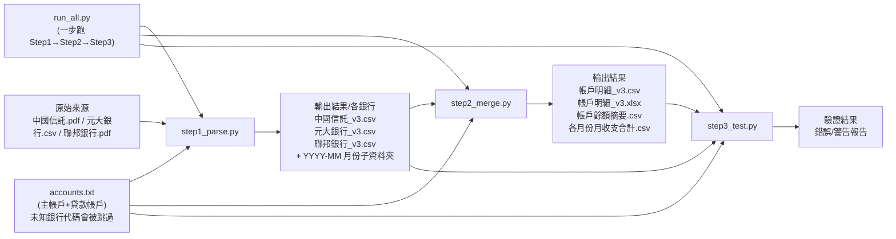
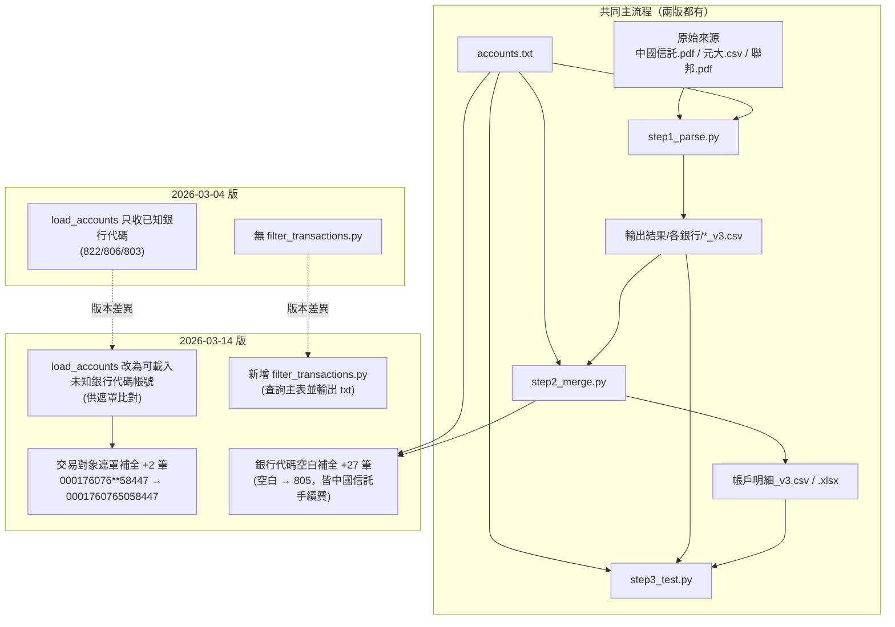
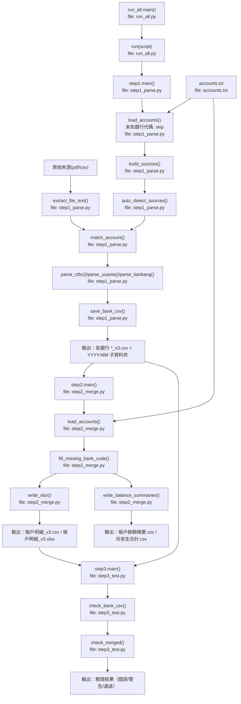
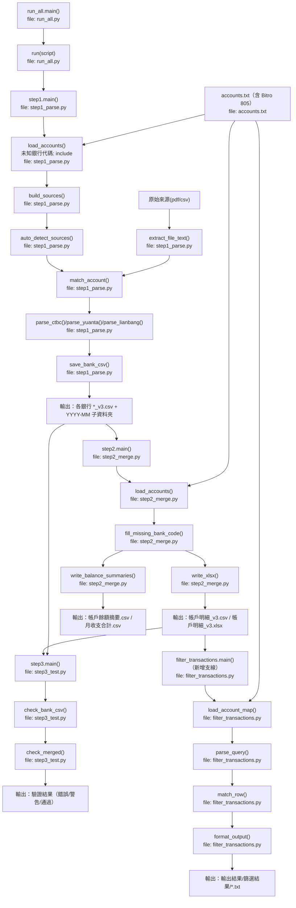

# 流程圖（原始圖版）

> 這份檔案保留對話中產出的「圖」，以 Mermaid 形式可在 GitHub 直接渲染。

## 圖 1：03-14 主流程鏈結圖

## 圖 2：03-04 基準流程圖

## 圖 3：03-04 vs 03-14 差異節點對照圖

## 圖 4：2026-03-04 方法級流程圖（時間序）

## 圖 5：2026-03-14 方法級流程圖（時間序）

